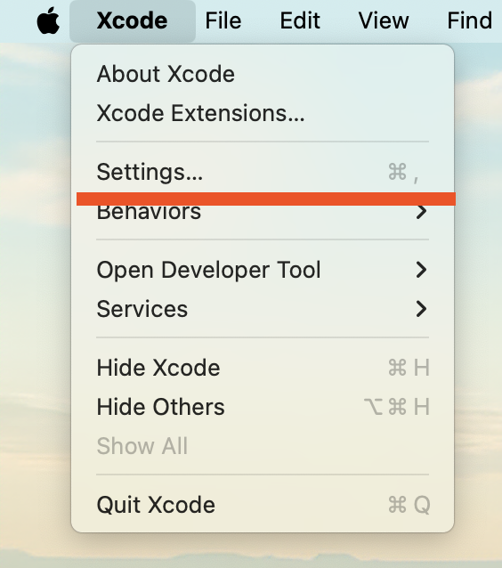
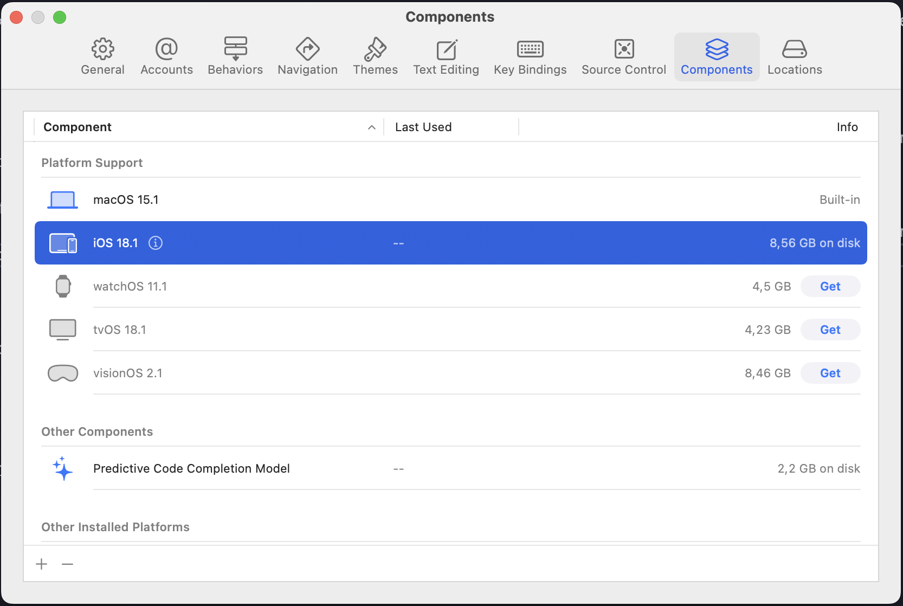

# iOS Troubleshooting

## Failed to build iOS project. "xcodebuild" exited with error code 70.

This error indicates that the required iOS simulator is not installed in Xcode.

```
iOS * is not installed. To use with Xcode, first download and install the platform
```

### Solution

To resolve this, install the iOS simulator through Xcode settings:

1. Open Xcode.
2. In the top menu, click on Xcode and select Settings….



3. In the Settings window, navigate to the Components tab.
4. Look for “iOS Simulator” in the list and click the Install button next to the desired version.



Once the simulator is installed, retry building your iOS project.
